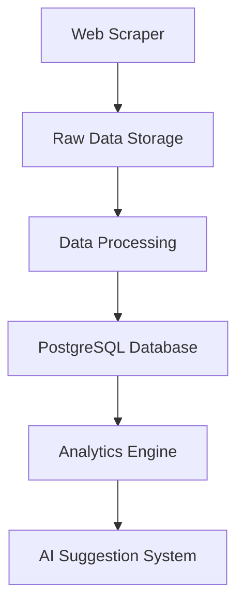

# ESN Pulse

## Project Overview

ESN Pulse is an AI-driven system designed to enhance event management for ESN Marmara. The system offers personalized event suggestions based on individual preferences and past event data.

## Installation Instructions

Follow these steps to set up ESN Pulse on your local machine:

### Prerequisites
- Python 3.8+
- PostgreSQL 13+
- Git

### Local Setup
1. Clone the repository:
   ```bash
   git clone https://github.com/erdemgunal/ESN-Pulse.git
   cd ESN-Pulse
   ```

2. Create a virtual environment and activate it:
   ```bash
   python -m venv venv
   source venv/bin/activate
   ```

3. Install the required dependencies:
   ```bash
   pip install -r requirements.txt
   ```

4. Set up the database:
   ```bash
   createdb esn_pulse
   python scripts/init_db.py
   ```

5. Run the application:
   ```bash
   python main.py
   ```

## Table of Contents

- [Project Overview](#project-overview)
- [Installation Instructions](#installation-instructions)
- [Architecture Overview](#architecture-overview)
- [API Documentation](#api-documentation)
- [Troubleshooting Guide](#troubleshooting-guide)
- [Development Setup](#development-setup)
- [Contributing](#contributing)
- [Deployment](#deployment)
- [Project Status](#project-status)
- [Success Metrics](#success-metrics)
- [Reports](#reports)

## Architecture Overview

### System Components

- **Data Collection Layer**
  - Web Scraping Module (BeautifulSoup4)
  - Rate-limited API Clients
  - Data Validation Services

- **Data Storage Layer**
  - PostgreSQL Database
  - Schema Design (as defined in PRD Section 7)
  - Data Migration Tools

- **Processing Layer**
  - ETL Pipeline
  - AI Integration Services
  - Analytics Engine

### Data Flow



## API Documentation

### Data Collection Endpoints
- `GET /organisation/{sube_adi}`
  - **Purpose**: Retrieve organization details
  - **Parameters**: `sube_adi` (string)
  - **Response**: Organization object

### Database Schema
Refer to our [Database Schema Documentation](./docs/schema.md) for detailed information about:
- Organizations Table
- Activities Table
- Statistics Table

### Integration Points
- ESN Activities Portal
- AI Services
- Analytics Engine

## Troubleshooting Guide

### Common Issues

1. **Database Connection Errors**
   ```bash
   error: could not connect to database
   ```
   **Solution:**
   - Verify PostgreSQL is running
   - Check credentials in `.env` file
   - Ensure database exists

2. **Scraping Issues**
   **Symptoms:**
   - Empty data results
   - Rate-limiting errors
   
   **Solutions:**
   - Check network connectivity
   - Verify API endpoints
   - Adjust rate-limiting parameters

3. **Data Processing Errors**
   - Check log files in `/logs` directory
   - Verify data format matches schema

## Development Setup

### Prerequisites
- Python 3.8+
- PostgreSQL 13+
- Git

### Local Development
1. **Clone and Setup**
   ```bash
   git clone https://github.com/erdemgunal/ESN-Pulse.git
   cd ESN-Pulse
   python -m venv venv
   source venv/bin/activate
   pip install -r requirements-dev.txt
   ```

2. **Database Setup**
   ```bash
   createdb esn_pulse
   python scripts/init_db.py
   ```

3. **Running Tests**
   ```bash
   pytest tests/
   ```

### Code Style
- We use Black for code formatting
- Flake8 for linting
- Pre-commit hooks available

## Contributing

### Development Process
1. **Fork and Clone**
   ```bash
   git clone https://github.com/erdemgunal/ESN-Pulse.git
   ```

2. **Create Feature Branch**
   ```bash
   git checkout -b feature/your-feature-name
   ```

3. **Commit Guidelines**
   - Use semantic commit messages:
     - `feat:` New feature
     - `fix:` Bug fix
     - `docs:` Documentation
     - `test:` Tests
     - `refactor:` Code refactoring

4. **Testing**
   - Write unit tests for new features
   - Ensure all tests pass
   - Maintain >80% coverage

5. **Pull Request Process**
   - Update documentation
   - Add tests
   - Get review from 2 team members

## Deployment

### Production Setup

1. **Server Requirements**
   - Ubuntu 20.04 LTS
   - Python 3.8+
   - PostgreSQL 13+
   - Nginx

2. **Environment Setup**
   ```bash
   sudo apt-get update
   sudo apt-get install python3-pip postgresql nginx
   ```

3. **Application Deployment**
   ```bash
   git clone https://github.com/erdemgunal/ESN-Pulse.git
   cd ESN-Pulse
   python -m venv venv
   source venv/bin/activate
   pip install -r requirements.txt
   ```

4. **Database Migration**
   ```bash
   python manage.py migrate
   ```

5. **Service Configuration**
   - Set up systemd service
   - Configure Nginx reverse proxy
   - Enable SSL with Let's Encrypt

## Project Status

[](https://travis-ci.org/username/ESN-Pulse)
[](https://coveralls.io/github/username/ESN-Pulse?branch=main)
[](https://opensource.org/licenses/MIT)

## Success Metrics

The success of ESN Pulse will be measured by:
- Increase in event participation
- Event diversity metrics
- Student satisfaction rates
- Social media engagement
- Cross-sectional collaboration

## Project Timeline

- **Phase 1:** Data Collection Infrastructure (Current)
- **Phase 2:** Analytics Engine Development (Q2 2024)
- **Phase 3:** AI Integration (Q3 2024)
- **Phase 4:** Web Interface (Q4 2024)

## Reports

Here are some visual reports generated by ESN Pulse:

### Activity Causes


### Activity Types by Month


### Demographic Distribution


### Popular Activity Types


### Seasonal Trends


### Successful Organisations
